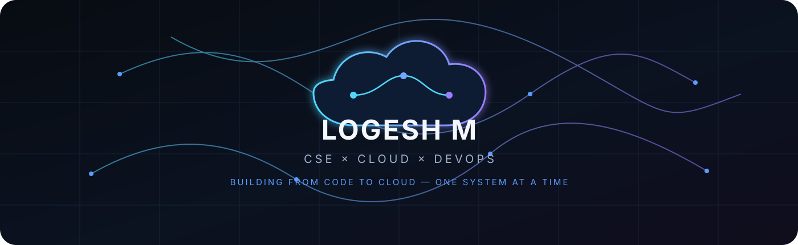
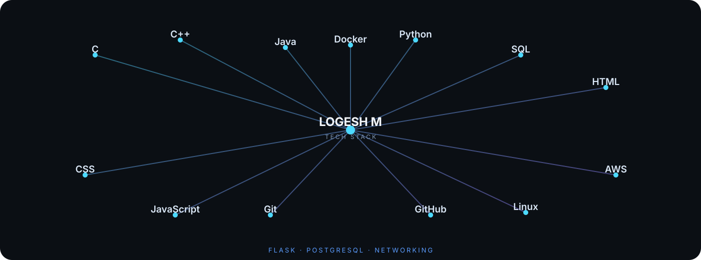

### `LOGESH M`

**B.Tech CSE · VIT Vellore · 2nd Year / 3rd Semester**

`CSE` · `Cloud` · `DevOps`

---

### ⚡ TECHNOLOGY UNIVERSE

 

---

### ◈ GITHUB ACTIVITY

 

<picture>
  <source media="(prefers-color-scheme: dark)" srcset="https://raw.githubusercontent.com/LOGESH-7M/LOGESH-7M/output/github-snake-dark.svg">
  <source media="(prefers-color-scheme: light)" srcset="https://raw.githubusercontent.com/LOGESH-7M/LOGESH-7M/output/github-snake.svg">
  
</picture>

---

### ◇ LEETCODE

---

### CONNECT

[LinkedIn](https://www.linkedin.com/in/logesh07mvit/) · [LeetCode](https://leetcode.com/u/LOGESH__M/) · [Email](mailto:logesh07m@gmail.com)

 

Building from code to cloud — one system at a time.

