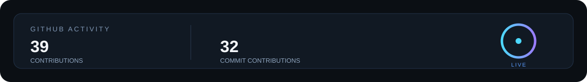

 

**B.Tech CSE · VIT Vellore · 3rd Sem**

`DevOps` · `Cloud` · `Backend` · `Linux` · `Networking`

---

### TECH • STACK

---

### GITHUB ACTIVITY

 

<picture>
  <source media="(prefers-color-scheme: dark)"
          srcset="https://raw.githubusercontent.com/LOGESH-7M/LOGESH-7M/output/github-snake-dark.svg">
  <source media="(prefers-color-scheme: light)"
          srcset="https://raw.githubusercontent.com/LOGESH-7M/LOGESH-7M/output/github-snake.svg">
  
</picture>

---
### LEETCODE

<!-- If GitHub still renders the icons with a tiny underline, use the local SVGs instead: -->

<h3>CONNECT</h3>

 

&nbsp;&nbsp;&nbsp;&nbsp;

&nbsp;&nbsp;&nbsp;&nbsp;

